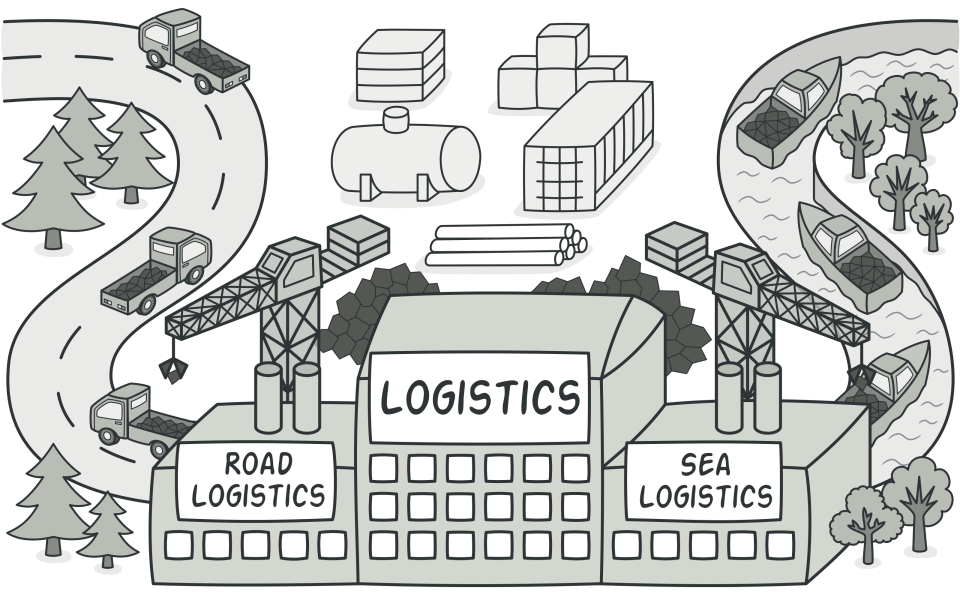
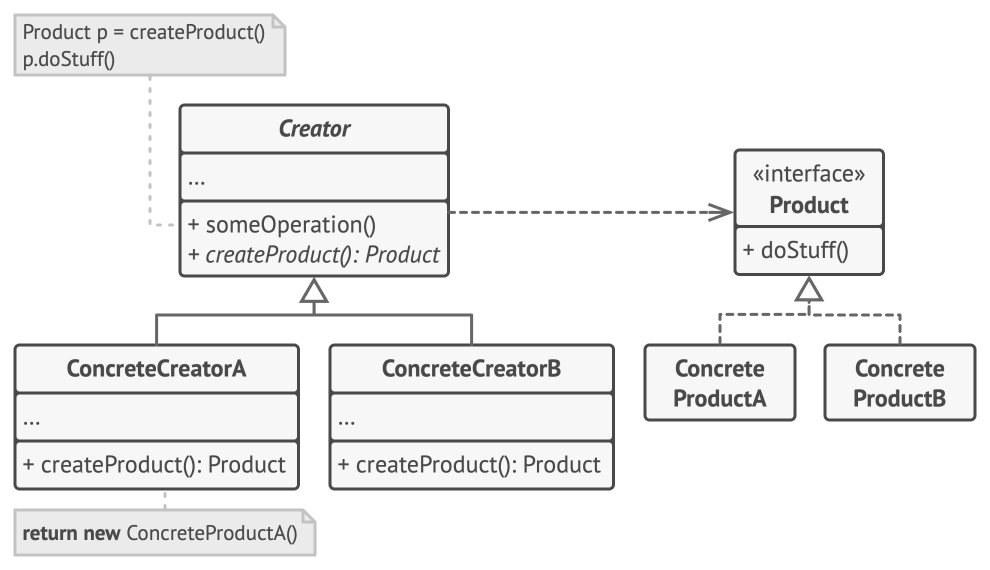

## Also known as

* Virtual Constructor

- Complexity: ⭐⭐
- Popularity: ⭐⭐⭐

## Intent of Factory Method Design Pattern

Define an interface for creating an object using the Factory Method Pattern, but let subclasses decide which class to instantiate.

This creation design pattern lets a class defer instantiation to subclasses, enhancing code flexibility and maintenance.

## Example

> App Logistics chỉ có class `Truck`. Nếu thêm `Ship` sẽ cần thay đổi cả codebase

> Blacksmith (Thợ rèn) sản xuất vũ khí.
>  - Elf cần vũ khí của Elf
>  - Orc cần vũ khí của Orc
> 
> Tùy thuộc vào khách hàng mà loại thợ rèn phù hợp sẽ được triệu hồi.

## Solution

## When to Use the Factory Method Pattern

- Class không thể dự đoán lớp đối tượng mà nó phải tạo
- Class muốn subclasses chỉ định các đối tượng mà nó tạo ra.

## Real-World Applications of Factory Method Pattern in Java

* [java.util.Calendar](http://docs.oracle.com/javase/8/docs/api/java/util/Calendar.html#getInstance--)
* [java.util.ResourceBundle](http://docs.oracle.com/javase/8/docs/api/java/util/ResourceBundle.html#getBundle-java.lang.String-)
* [java.text.NumberFormat](http://docs.oracle.com/javase/8/docs/api/java/text/NumberFormat.html#getInstance--)
* [java.nio.charset.Charset](http://docs.oracle.com/javase/8/docs/api/java/nio/charset/Charset.html#forName-java.lang.String-)
* [java.net.URLStreamHandlerFactory](http://docs.oracle.com/javase/8/docs/api/java/net/URLStreamHandlerFactory.html#createURLStreamHandler-java.lang.String-)
* [java.util.EnumSet](https://docs.oracle.com/javase/8/docs/api/java/util/EnumSet.html#of-E-)
* [javax.xml.bind.JAXBContext](https://docs.oracle.com/javase/8/docs/api/javax/xml/bind/JAXBContext.html#createMarshaller--)
* Frameworks that run application components, configured dynamically at runtime.

## Benefits and Trade-offs of Factory Method Pattern

⚠️ Code can be complicated by requiring the addition of new subclasses to implement the extended factory methods.
